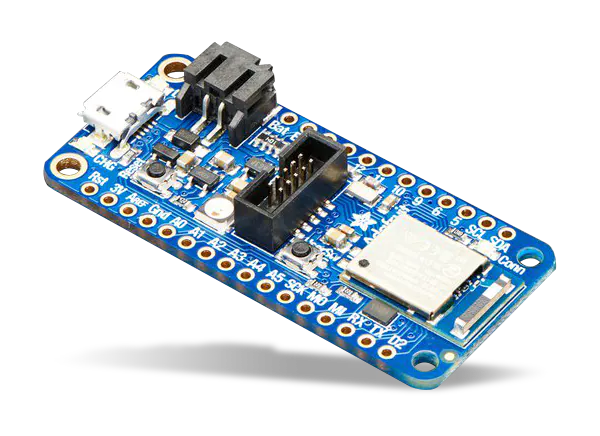

# TCPlp Experiments on Commodity Hardware

Implementation of TCPlp experiments for Adafruit Express nrf52840. Unlike the research project, we leverage a commodity development board and the now merged TCPlp implementation within [OpenThread](https://github.com/openthread/openthread/pull/6650#issuecomment-1027330004).

Anna: Sending relevant files for grading. Much of the code we use is contained in the OpenThread implementation, as linked in the GitHub issue above. Other code is contained here, including a single C source file and ``usb.overlay`` to enable the UART shell, a ``Kconfig`` and ``prj.conf`` to enable OpenThread TCP, and ``CMakeLists.txt`` to build the project. Additionally, the commands to run the benchmark and slides are in ``assets/``.
